# WhatsApp Lite

WhatsApp like mobile chat application built with React Native, Expo, and Firebase.

# Libraries used

-   **`React`** the love of my life
-   **`React Native`** because I love React
-   **`Expo`** for easy development and deployment
-   **`Firebase`** for authentication, realtime database and file storage
-   **`Redux Toolkit`** for state management
-   **`Typescript`** for type safety, cure for headache you get when props are flowing all over the app with no hint
-   **`React Navigation`** for in app navigation

# Features

-   Authentication with email and password
-   Realtime chat with other users
-   Group chat and private chats
-   Send images in chat
-   Reply to individual messages in chat by taggging the message
-   Push notifications for new messages
-   User profile with profile picture
-   Search for other users
-   Leaving group chats

**and much more....**

# Installation

Clone project

```
git clone git@github.com:saalikmubeen/whatsApp-lite.git
```

```
cd whatsApp-lite
```

`npm install` to to install dependencies

`Setup required environment variables for firebase:`

_Make a **`.env`** file inside the root directory with below environment variables_

-   EXPO_PUBLIC_FIREBASE_API_KEY
-   EXPO_PUBLIC_FIREBASE_AUTH_DOMAIN
-   EXPO_PUBLIC_FIREBASE_PROJECT_ID
-   EXPO_PUBLIC_FIREBASE_STORAGE_BUCKET
-   EXPO_PUBLIC_FIREBASE_MESSAGING_SENDER_ID
-   EXPO_PUBLIC_FIREBASE_APP_ID
-   EXPO_PUBLIC_FIREBASE_MEASUREMENT_ID
-   EXPO_PUBLIC_FIREBASE_DATABASE_URL

`npm start` to start the expo development server.

Press `a` to run the app on android emulator or `i` to run on ios simulator.

# Screenshots

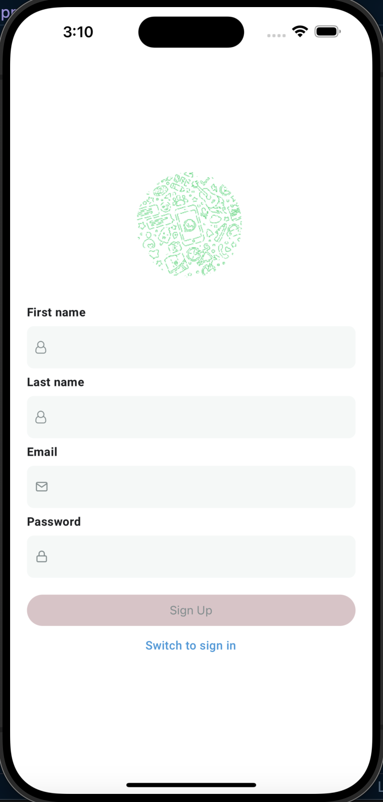
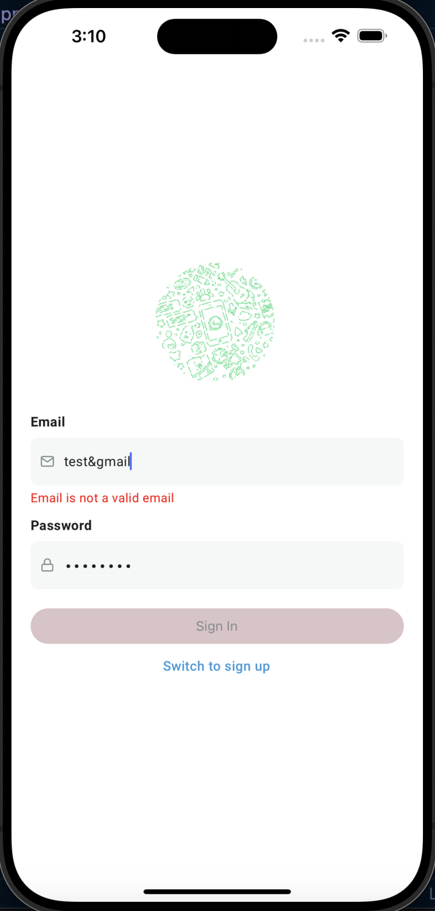

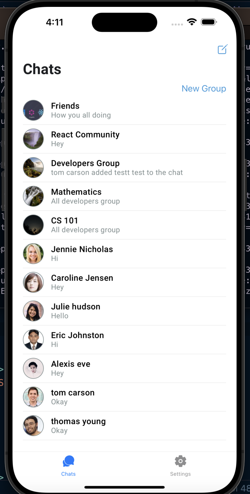
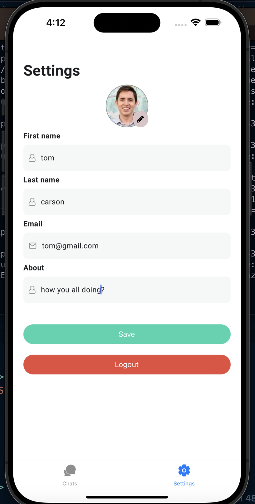
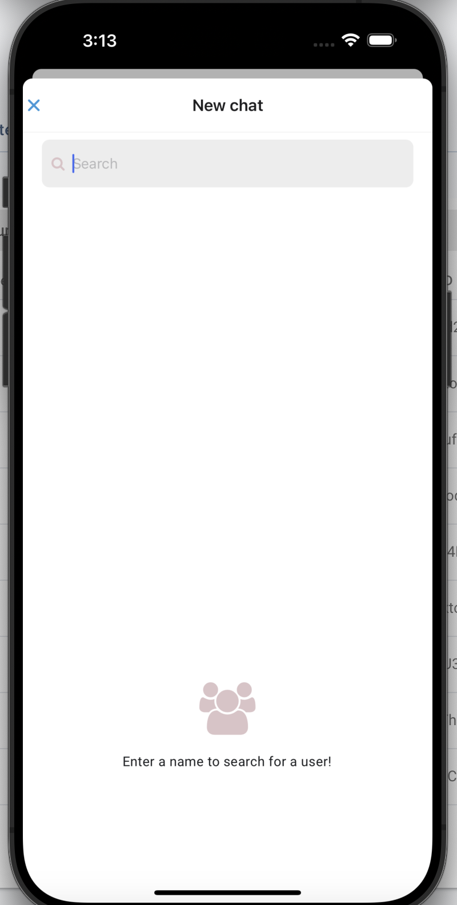
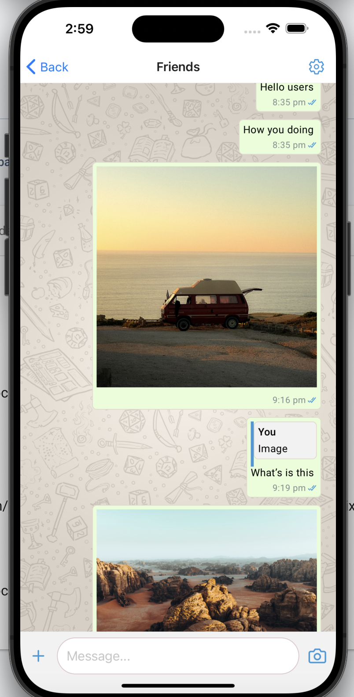
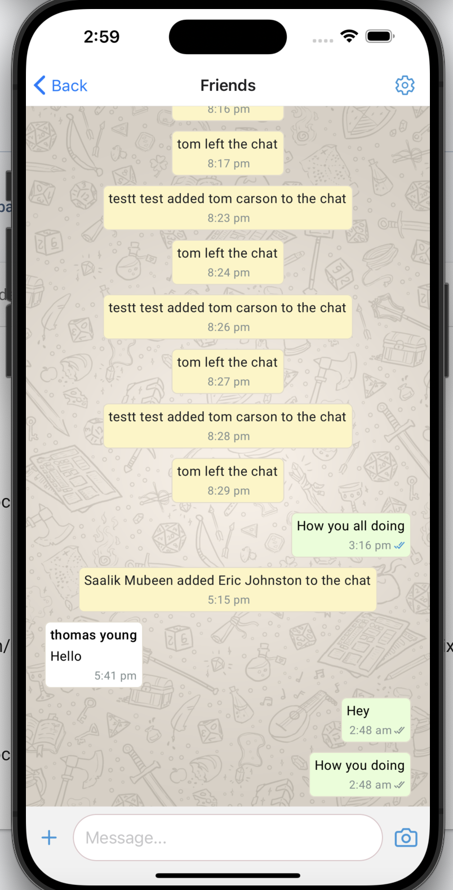

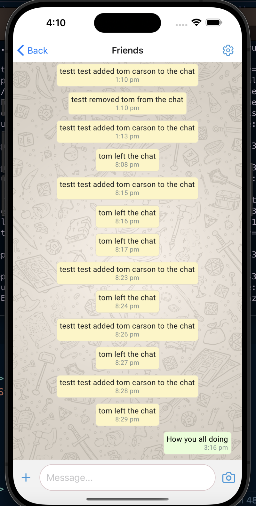
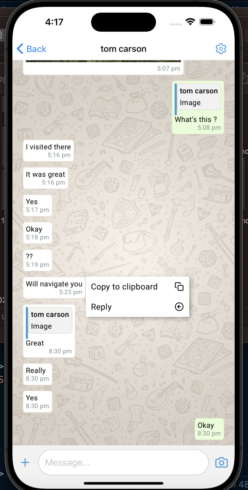
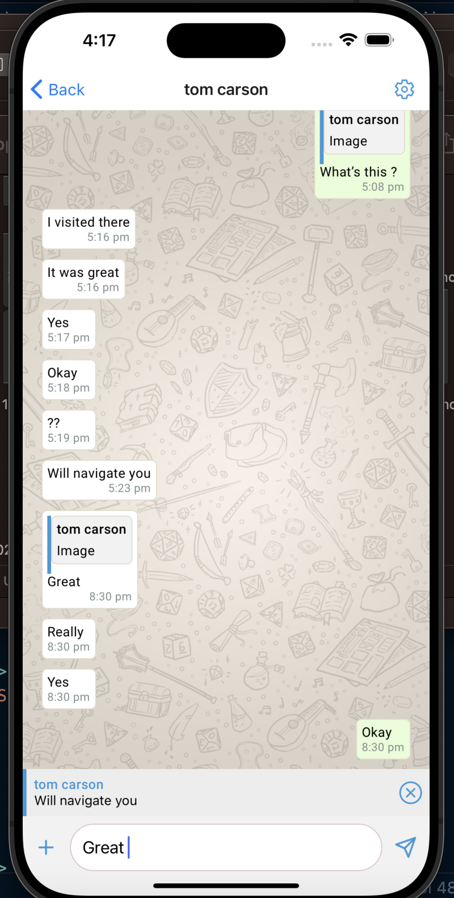
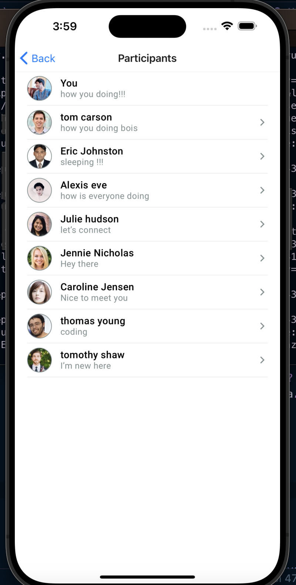

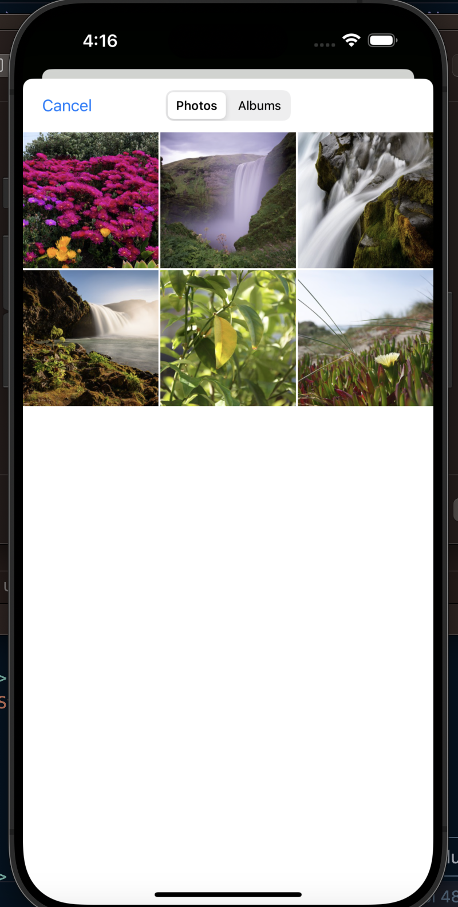
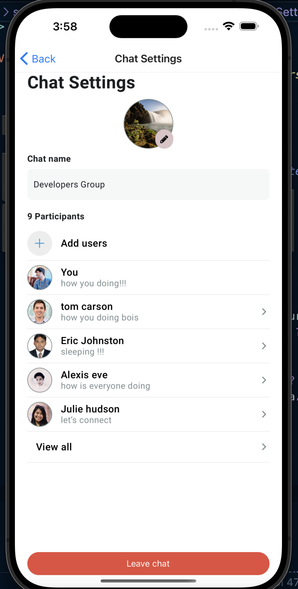
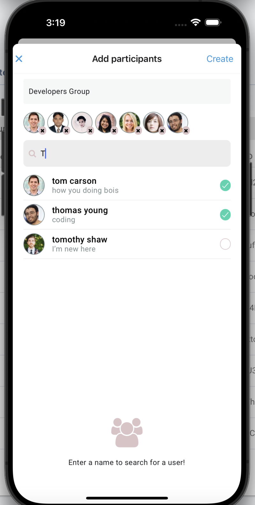
